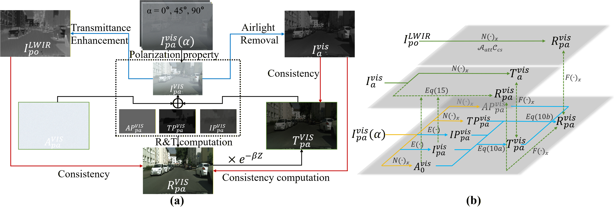
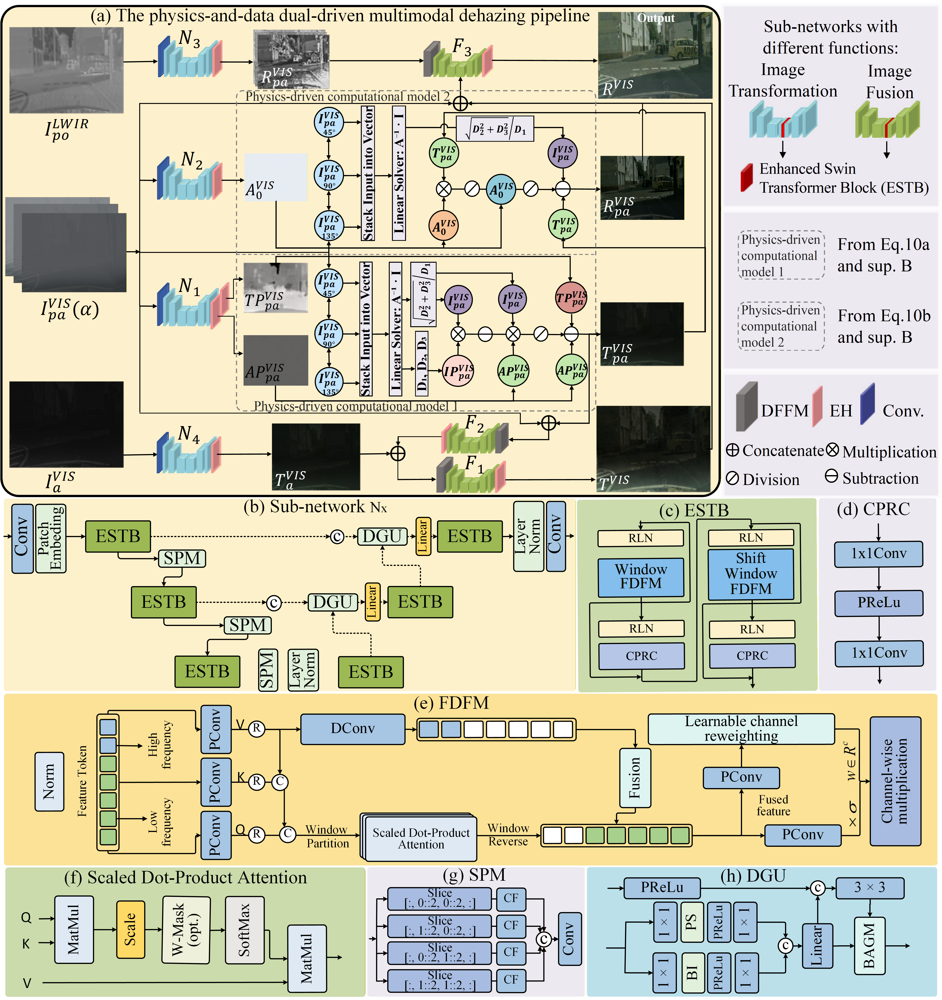
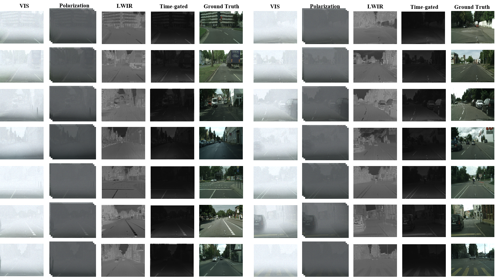
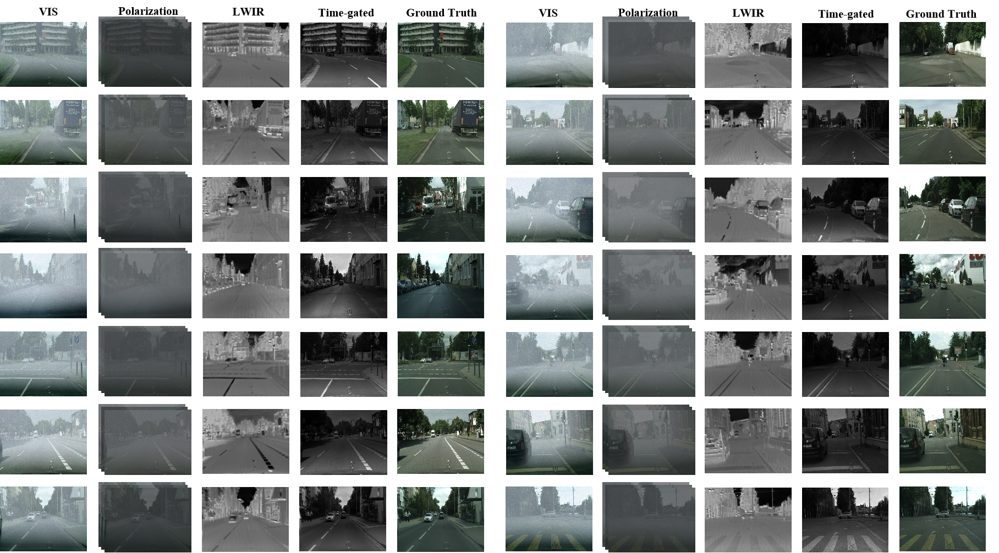
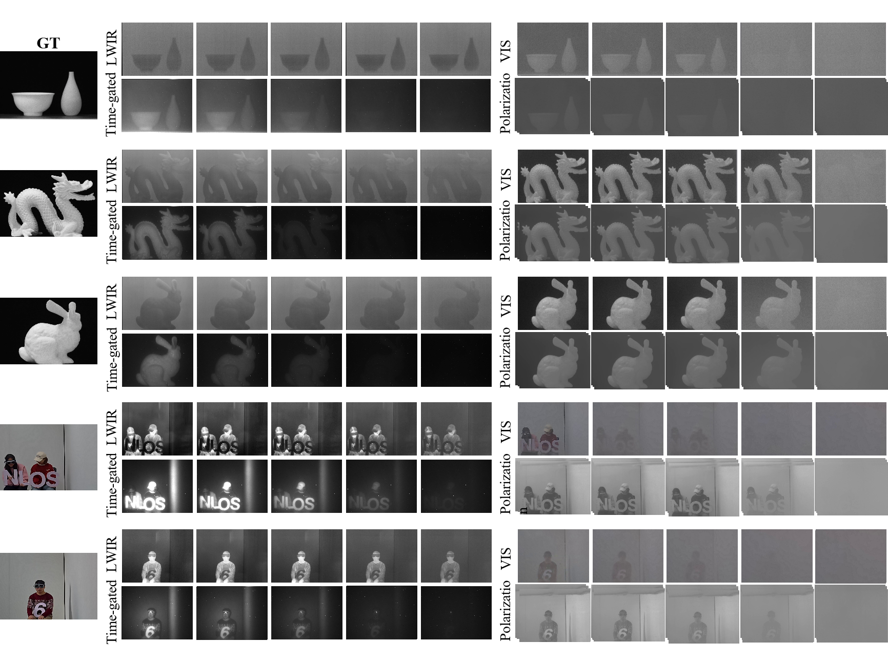
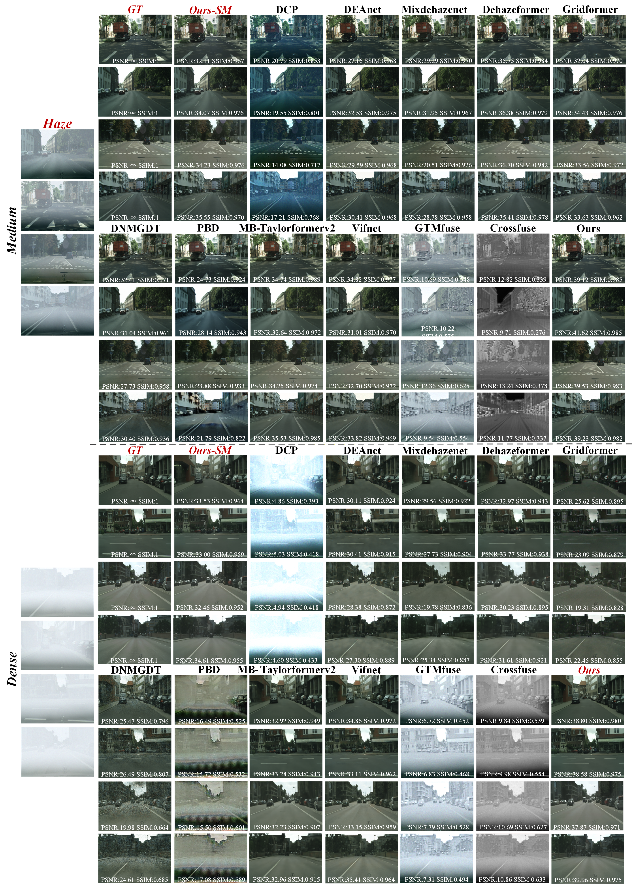
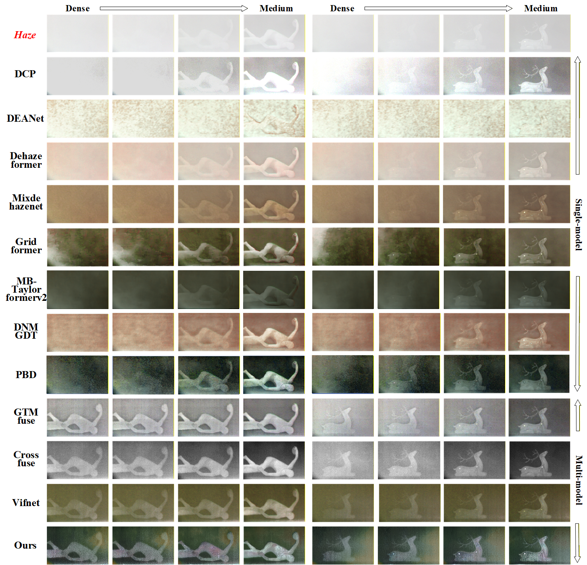
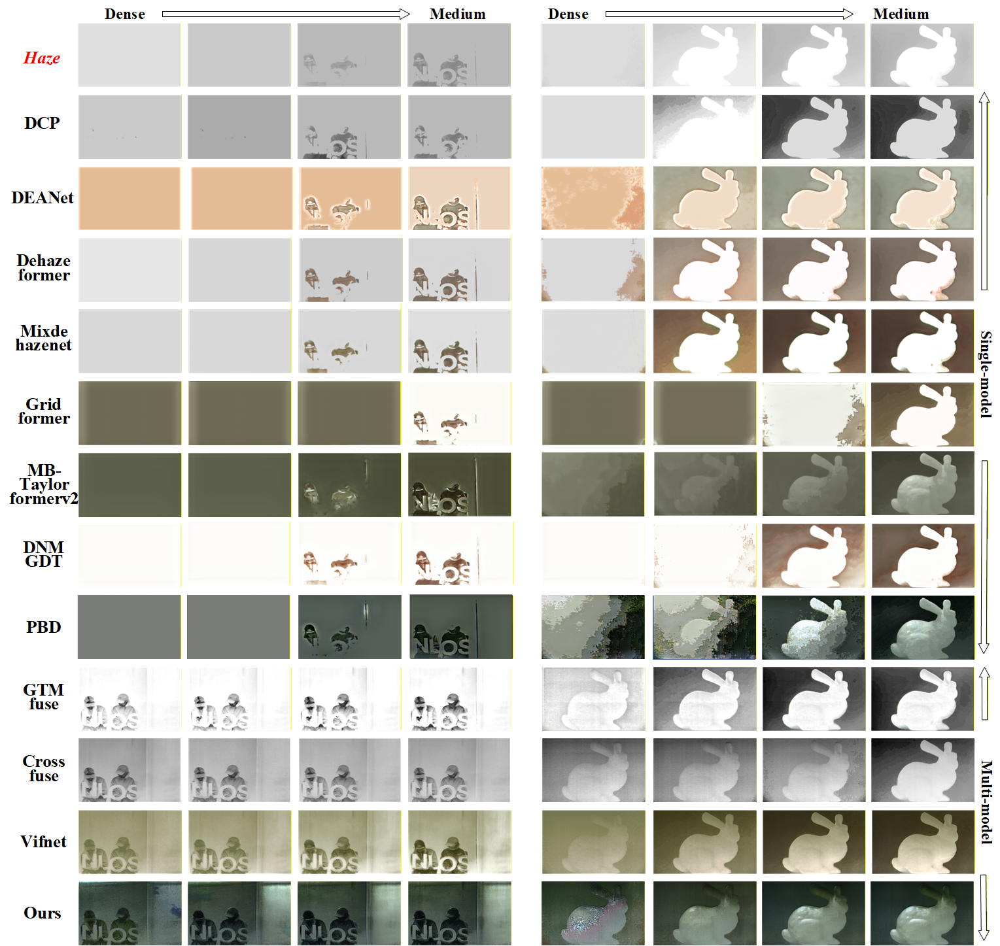

# DDPCFMD

**Dual-Driven Physically Consistent Fusion for Multimodal Dehazing**

Ziqin Xu, Guangpeng Li, Hao Liu, Hongru Zhao, Mingyang Chen, Hongzhao Li,
Shaohui Jin, Mingyuan Jiu, and Mingliang Xu.

Accepted by *IEEE Transactions on Multimedia*.

DDPCFMD combines visible-light polarization (VLP), time-gated imaging (TGI),
and long-wave infrared (LWIR) through physical parameter estimation and fusion.
This repository contains the model, three-stage training code, and training
settings from the research source.
## Overview

**Multimodal physical consistency and fusion framework**



**Physics-and-data dual-driven dehazing pipeline**



## Dataset examples

**syn-MH**: synthetic multimodal observations under dense and medium haze.





**real-MH**: real-scene observations from the multimodal imaging system.



## Visual comparisons

Comparison figures from the original project and paper:







## Installation

Use Python 3.10 or newer and a PyTorch build suitable for your device.
Training data loading also requires NumPy and Pillow.

```bash
pip install -r requirements.txt
```

## Training data
```text
your_training_directory/
  I_alpha/sample.npy       H x W x 9: three RGB polarization views
  I_hat/sample.png         RGB total visible-light intensity
  delta_I_hat/sample.png   RGB intensity times degree of polarization
  P_A/sample.npy           Three-element airlight DoP vector
  P_T/sample.png           RGB transmitted-light DoP
  T/sample.png             RGB transmitted-light target
  gated/sample.png         Grayscale TGI observation
  ir_foggy/sample.png      Grayscale LWIR observation
  A_infinity/sample.png    RGB airlight target
  R/sample.png             RGB clear-radiance target
```

NPY values use the [0, 1] scale; PNG files use 8-bit values. The loader expands
the airlight DoP vector spatially and resizes the image fields with antialiased
bilinear interpolation.


## Training

The three configurations retain the training settings from the research source.
The entry point selects the configuration matching `--stage` automatically;
use `--config` to provide an edited copy.

| Stage | Configuration | Epochs | Batch size | Initial learning rate |
| --- | --- | --- | --- | --- |
| Transmission estimation | [`transmission.json`](configs/transmission.json) | 400 | 9 | 0.0005 |
| Radiance reconstruction | [`radiance.json`](configs/radiance.json) | 400 | 5 | 0.0001 |
| Joint training | [`joint.json`](configs/joint.json) | 400 | 4 | 0.0005 |

All stages use 240 x 320 inputs, Adam with `betas=[0.5, 0.999]`, AMSGrad,
and zero weight decay. Each loss weight pair is `[L1, L2]`; stage-specific
weights are defined in the corresponding configuration. Convolution weights
are initialized from a zero-mean normal distribution with standard deviation 0.02,
linear weights use Xavier uniform initialization, and their biases are zeroed
before any checkpoint weights are loaded.

The first two stages use `branch_decay`: at the end of each epoch after 300,
`MultiplicativeLR` multiplies the **current** learning rate by `2.5 - epoch / 200`.
The joint stage uses `constant`. This preserves the source schedule; the
branch multiplier is applied cumulatively, rather than as a linear interpolation
of the initial learning rate. The branch schedule is intended for 400 epochs
and requires a total below 500 to keep its multiplier positive.

Run from the repository root, replacing `PATH_TO_TRAIN_DATA` with your data path:

```bash
# Stage 1: transmission estimation
python train.py --stage transmission --data-root PATH_TO_TRAIN_DATA --output-dir outputs/transmission

# Stage 2: radiance reconstruction
python train.py --stage radiance --data-root PATH_TO_TRAIN_DATA --output-dir outputs/radiance

# Stage 3: joint training initialized from the two trained branches
python train.py --stage joint --data-root PATH_TO_TRAIN_DATA --transmission-weights outputs/transmission/transmission-last.pth --radiance-weights outputs/radiance/radiance-last.pth --output-dir outputs/joint
```


Training saves `<stage>-last.pth` every `save_every` epochs and at the final
epoch. To resume an interrupted run, keep the same configuration and provide
`--resume`. To extend a completed run, increase `epochs` to the desired total;
keep the optimizer, loss, and scheduler settings unchanged:

```bash
python train.py --stage joint --data-root PATH_TO_TRAIN_DATA --output-dir outputs/joint --resume outputs/joint/joint-last.pth
```

New outputs are ignored by Git. Checkpoints restore model, optimizer, scheduler,
and epoch state, without promising identical random sample order. Only
checkpoints created with this public naming scheme are supported.

## Model interface

```python
from models import DDPCFMD

model = DDPCFMD(image_size=(240, 320))
# output = model(vlp, intensity, polarization_difference, lwir, tgi)
```

Inputs are aligned floating-point NCHW tensors on the [0, 1] scale, with
9, 3, 3, 1, and 1 channels respectively. All inputs share batch size, spatial
size, dtype, and device. Each spatial dimension must be at least 80 and divisible
by 8. The output fields are `airlight_dop`, `transmission_dop`, `transmission`,
`tgi_transmission`, `airlight`, and `radiance`, each shaped `(N, 3, H, W)`.
Here, `transmission` is the transmitted-light image, not scalar transmittance.


## Citation

Please cite *Dual-Driven Physically Consistent Fusion for Multimodal Dehazing*,
Ziqin Xu et al., accepted by *IEEE Transactions on Multimedia*. Final
bibliographic details should follow the publisher's record when available.


Project: [Unconventional Vision Lab, Zhengzhou University](https://github.com/Unconventional-Vision-Lab-ZZU/DDPCFMD).
